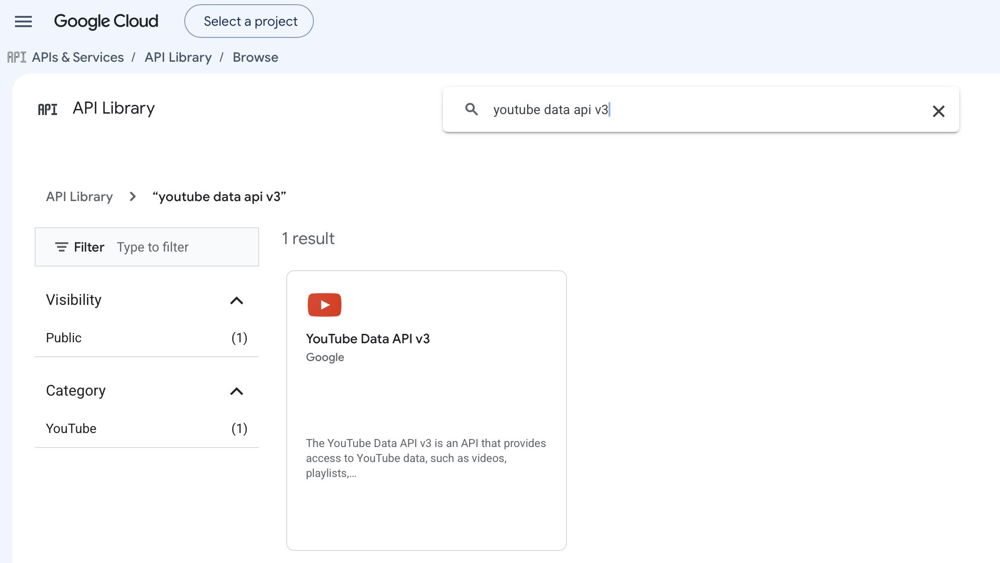
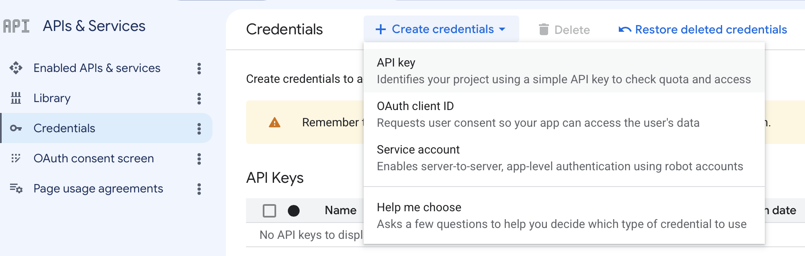
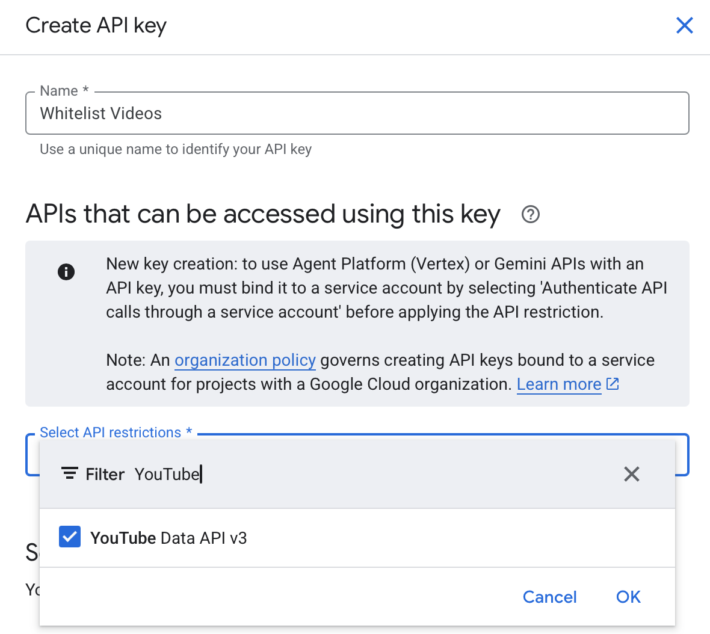

# Get a YouTube Data API Key

The app can search recent videos without an API key. Add a YouTube Data API key
when you want search to look deeper into older videos from approved channels.

## 1. Pick or Create a Google Cloud Project

Open the Google Cloud Console:

<https://console.cloud.google.com/>

Use the project picker in the top bar to select the project you want this app to
use. If you do not already have a project, create one first.

## 2. Enable YouTube Data API v3

Open **APIs & Services > Library**, or go directly to:

<https://console.cloud.google.com/apis/library>

Search for `youtube data api v3`, then open the **YouTube Data API v3** result.



Click **Enable**. If the button says **Manage** instead, the API is already
enabled for the currently selected project.

If you cannot find it from search, open the API page directly:

<https://console.cloud.google.com/marketplace/product/google/youtube.googleapis.com>

If that page opens for the wrong project, switch projects in the top bar and
check the API page again.

## 3. Create an API Key

Go to **APIs & Services > Credentials**.

Click **Create credentials**, then choose **API key**.



Google will create a key and show it to you. Copy it somewhere temporary until
you add it to the local app config.

## 4. Restrict the Key

After the key is created, open the key's settings. Give it a recognizable name,
such as `Kidstream`.

Under **API restrictions**, choose **Restrict key**, then select only
**YouTube Data API v3**.



Save the key.

For a local home-network deployment, leave **Application restrictions** set to
**None** unless you have a stable server/network setup and know which restriction
fits it. The important restriction for this app is limiting the key to
**YouTube Data API v3**.

## 5. Add the Key Locally

The safest option is to start the server with an environment variable:

```bash
export YOUTUBE_API_KEY="paste-your-key-here"
python3 server.py
```

You can also put it in `config/videos.local.json`:

```json
{
  "youtubeApiKey": "paste-your-key-here"
}
```

`config/videos.local.json` is ignored by git. Do not put API keys in
`config/videos.example.json`.
